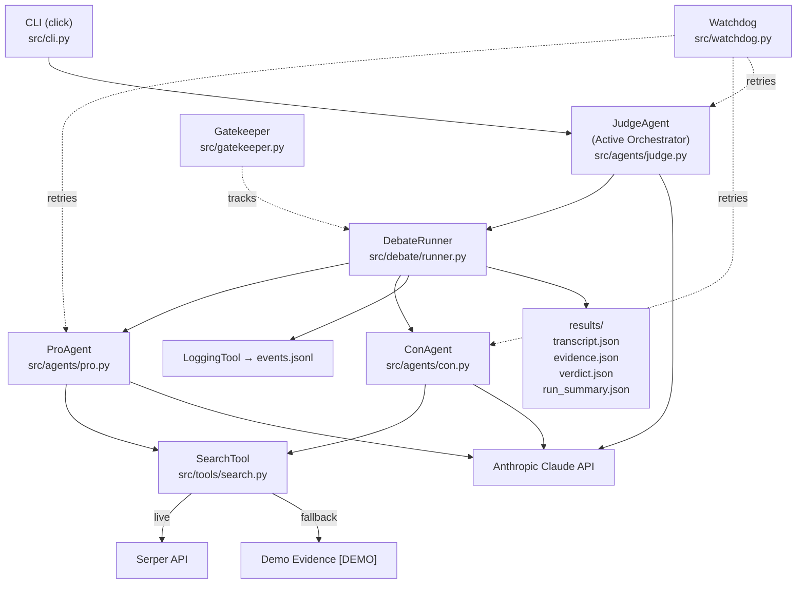
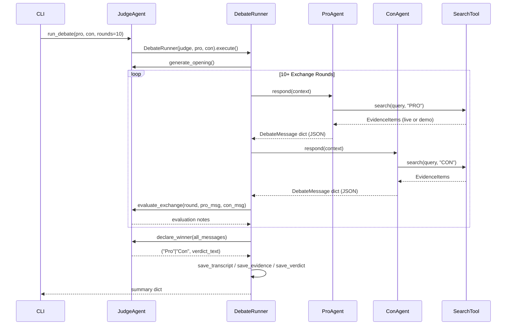
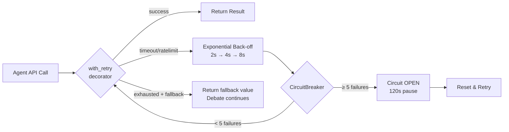

# AI Agent Debate System
### "Do Smartphones Make Us Less Smart?" — Senior Architecture v2

A CLI multi-agent AI debate: Pro vs Con with an active Judge moderator.
Structured JSON protocol · OOP inheritance · Skills/Tools separation · Watchdog · Gatekeeper.

---

## Assignment Goal

**Course:** Orchestration of AI Agents

Build a CLI-based multi-agent system in which two AI agents debate a controversial topic while a third **Judge agent** moderates the debate, evaluates argument quality after every exchange, and declares **exactly one winner** (no ties). The system must demonstrate:

- Orchestration of multiple AI agents with distinct, fixed roles
- Structured JSON inter-agent communication protocol
- Real-time external evidence retrieval via web search
- Robust error handling (retry, circuit breaker, graceful fallback)
- OOP agent hierarchy with a shared base class
- Clear separation between agent skills (prompts) and agent tools (code)
- Structured event logging and result persistence

---

## Debate Topic

> **"Do smartphones make us less smart?"**

The Pro agent argues **YES**; the Con agent argues **NO**. A minimum of 10 Pro↔Con exchanges must occur before the Judge may declare a winner.

---

## Three-Agent Architecture

| Agent | Class | Role |
|---|---|---|
| **Judge** | `JudgeAgent` | Active orchestrator — opens, evaluates, closes, declares winner |
| **Pro** | `ProAgent` | Argues YES — smartphones harm cognition |
| **Con** | `ConAgent` | Argues NO — smartphones augment cognition |

All three agents call the Anthropic Claude API. Pro and Con also call the SearchTool before each argument. The Judge evaluates after every Pro↔Con exchange and issues the final verdict after all rounds.

---

## Judge / Father Role

The **JudgeAgent** (`src/agents/judge.py`) is the debate's *Father* — the authority who controls the entire flow:

1. **`generate_opening()`** — issues the debate topic and rules to both debaters.
2. **`evaluate_exchange(round, pro_msg, con_msg)`** — after every round, scores both agents on argument quality, factual evidence, logical consistency, rebuttal strength, use of external sources, and relevance.
3. **`declare_winner(all_messages)`** — after ≥ 10 exchanges, reviews the full transcript and names exactly one winner. **Ties are strictly forbidden.** The response must contain `WINNER: Pro` or `WINNER: Con`; the system retries up to 3 times if the format is invalid.
4. **`run_debate(pro, con, num_rounds)`** — top-level entry point that delegates the exchange loop to `DebateRunner`.

The Judge never participates in the argument exchanges — it only evaluates and decides.

---

## Pro and Con Contradictory Skills

Each debater loads a markdown skill file (`src/skills/`) that fixes its position permanently. The positions are logically contradictory and enforced in every round.

| | Pro (`pro_skill.md`) | Con (`con_skill.md`) |
|---|---|---|
| **Position** | YES — smartphones make us less smart | NO — smartphones do NOT make us less smart |
| **Theme 1** | Attention Span — devices fragment focus | Knowledge Access — democratise information |
| **Theme 2** | Memory Dependency — outsourced recall weakens biological memory | Learning Support — educational apps extend opportunity |
| **Theme 3** | Cognitive Dependency — instant answers reduce problem-solving | Productivity — smart tools free up higher-order thinking |
| **Theme 4** | Distraction — notifications interfere with deep thinking | Communication — smartphones enhance collective intelligence |
| **Theme 5** | Academic Impact — studies link heavy use to lower performance | Cognitive Extension — devices act as external cognition |

Both agents rotate through their 5 themes, search for evidence before each argument, and are instructed never to agree with the opposing side. The `verify.py` script confirms all Pro messages carry `stance=PRO` and all Con messages carry `stance=CON`.

---

## Architecture Diagram



---

## Sequence Diagram



---

## Skills vs Tools Separation

| Concept | Location | Purpose |
|---|---|---|
| **Skill** | `src/skills/*.md` | Defines HOW the agent thinks: system prompt, persona, fixed position, evaluation criteria |
| **Tool** | `src/tools/*.py` | Defines WHAT the agent can do: search evidence, log events, track costs |

- `src/skills/judge_skill.md` — Judge evaluation criteria, verdict format
- `src/skills/pro_skill.md` — Pro position and argument themes
- `src/skills/con_skill.md` — Con position and argument themes
- `src/tools/search.py` — SearchTool (Serper + fallback)
- `src/tools/logging_tool.py` — JSONL structured event logger

Skills are markdown files loaded at agent init time via `BaseAgent._load_skill()` and injected as the Claude system prompt. Tools are Python classes called explicitly inside each agent's `respond()` method.

---

## JSON Communication Protocol

Every message between agents uses `DebateMessage` (`src/debate/protocol.py`):

```json
{
  "round_number": 3,
  "exchange_number": 3,
  "speaker": "Pro",
  "stance": "PRO",
  "claim": "Smartphones fragment attention...",
  "evidence": [
    {"snippet": "...", "url": "...", "source": "serper", "label": "live"}
  ],
  "tool_metadata": {
    "tools_used": ["search", "anthropic"],
    "search_queries": ["smartphones reduce attention span study"],
    "search_results_count": 3,
    "fallback_used": false
  },
  "rebuttal_target": "opponent's prior claim snippet...",
  "confidence_score": 0.85,
  "timestamp": "2026-06-07T21:11:50",
  "status": "complete"
}
```

All fields are mandatory. The `status` field is checked by `verify.py`. Evidence items carry a `label` field (`"live"` for Serper results, `"fallback/demo"` for pre-written evidence) so that demo data is never presented as live search results.

---

## OOP Agent Hierarchy

```
BaseAgent (ABC)          # _load_skill(), _api_call(), respond()
  ├── DebaterAgent       # respond(), _call_claude() with retry, search integration
  │     ├── ProAgent     # stance=PRO, 10 rotating search queries
  │     └── ConAgent     # stance=CON, 10 rotating search queries
  └── JudgeAgent         # generate_opening(), evaluate_exchange(), declare_winner(), run_debate()
```

---

## Watchdog Design



- File: `src/watchdog.py`
- `with_retry(fallback=...)` — never kills the debate; returns fallback if all retries fail
- `CircuitBreaker` — global instance protects Serper API calls

---

## Gatekeeper / Context Economy

`src/gatekeeper.py` tracks per-run context consumption and is saved to `results/run_summary.json`:

| Metric | Description |
|---|---|
| `rounds` | Debate rounds completed |
| `exchanges` | Pro+Con exchange pairs |
| `characters_used` | Total API response characters |
| `approx_tokens` | characters ÷ 4 estimate |
| `search_calls` | Total SearchTool invocations |
| `retries` | Watchdog retry events |
| `failures_recovered` | Calls recovered via fallback |

The Gatekeeper provides visibility into API usage and cost without requiring billing access. Every runner tick increments the appropriate counters so the final summary reflects the true cost of a run.

---

## FIFO / JSONL Event Logging

`src/tools/logging_tool.py` writes **one JSON object per line** to `results/events.jsonl` in FIFO (first-in, first-out) append order:

```
{"timestamp": "...", "event_type": "debate_start", "topic": "...", "num_rounds": 10}
{"timestamp": "...", "event_type": "debate_message", "speaker": "Pro", "round": 1, ...}
{"timestamp": "...", "event_type": "judge_evaluation", "round": 1, "notes_chars": 312}
{"timestamp": "...", "event_type": "debate_message", "speaker": "Con", "round": 1, ...}
...
{"timestamp": "...", "event_type": "verdict", "winner": "Con", "verdict_chars": 850}
{"timestamp": "...", "event_type": "debate_end", "winner": "Con", "total_exchanges": 10}
```

The file is **truncated at the start of every run** (not appended from prior runs) so it always reflects only the most recent execution. Each line is valid JSON and can be read with `python3 -m json.tool`. Loguru also writes a rotating `results/debate.log` for human-readable console-style output.

Event types: `debate_start`, `debate_message`, `judge_evaluation`, `verdict`, `error`, `debate_end`.

---

## External Search Setup

```bash
# Set in .env:
SERPER_API_KEY=your-key-from-serper.dev
```

If not set, the system automatically uses clearly-labelled demo evidence:
> `[DEMO EVIDENCE] Research suggests...`

Live search uses `https://google.serper.dev/search` (POST, `X-API-KEY` header).

---

## Fallback Mode

When `SERPER_API_KEY` is missing: search returns pre-written evidence labelled `"label": "fallback/demo"`.
When `ANTHROPIC_API_KEY` is missing: run `--demo` flag for pre-written full arguments.
The system never crashes due to missing keys — it degrades gracefully.

---

## UV Setup Commands

```bash
# Install UV
curl -LsSf https://astral.sh/uv/install.sh | sh

# Create virtual environment
uv venv .venv
source .venv/bin/activate   # Linux/Mac
# .venv\Scripts\activate    # Windows

# Install dependencies
uv pip install -r requirements.txt

# Configure API keys
cp .env.example .env
# Edit .env: ANTHROPIC_API_KEY=sk-ant-...  (required for live run)
#            SERPER_API_KEY=...             (optional — enables live search)
```

---

## CLI Run Commands

```bash
# Demo run — no API key required, architecture fully exercised
python -m src.main debate --demo

# Live run — requires ANTHROPIC_API_KEY in .env
python -m src.main debate

# Custom rounds (min 10)
python -m src.main debate --rounds 12

# Debug logging
python -m src.main debate --verbose

# Show loaded config
python -m src.main show-config

# Health-check Anthropic API
python -m src.main check-health

# Display saved transcript
python -m src.main show-transcript
```

**API key explanation:**
- `ANTHROPIC_API_KEY` — **required** for live mode. The system exits with a clear `ConfigurationError` if it is missing or empty. Obtain from [console.anthropic.com](https://console.anthropic.com).
- `SERPER_API_KEY` — **optional**. If absent, the SearchTool falls back to pre-written evidence labelled `[DEMO EVIDENCE]`. Live search is never falsely claimed when the key is missing.

---

## Verification Commands

```bash
# Run all 12 verification checks
python tests/verify.py

# Check every Python file is ≤ 150 lines
find src -name "*.py" | xargs wc -l | sort -n

# Inspect saved results
cat results/verdict.json
cat results/run_summary.json
head -5 results/events.jsonl | python3 -m json.tool
```

---

## Result Files

| File | Contents |
|---|---|
| `results/transcript.json` | All 20 DebateMessage objects with full JSON protocol |
| `results/evidence.json` | Evidence by round (Pro + Con) |
| `results/verdict.json` | Winner (`"Pro"` or `"Con"`) + full verdict text |
| `results/events.jsonl` | Structured JSONL event log (one JSON object per line) |
| `results/run_summary.json` | Gatekeeper stats (rounds, tokens, searches, retries) |
| `results/debate.log` | Rotating loguru file log |

---

## GitHub Commit/Push Workflow

```bash
git add src/ tests/ results/ pyproject.toml .env.example plan.md README.md todo.md
git commit -m "feat: implement senior architecture v2 — OOP agents, JSON protocol, watchdog, gatekeeper"
git push origin main
git tag v2.0.0
git push origin --tags
```

---

## Committed Results

The result files committed to this repository (`results/transcript.json`, `results/verdict.json`, `results/evidence.json`, `results/run_summary.json`, `results/events.jsonl`) were generated with:

```bash
python3 -m src.main debate --demo --rounds 10
```

This runs in **demo mode** — no API keys are required. All arguments are pre-written and clearly labelled `[DEMO MODE]`. The winner (`Con`) and verdict text are deterministic pre-written content; they do not reflect a live LLM judgment. No live API calls were made to generate these committed results.

**Live mode** requires:
- `ANTHROPIC_API_KEY` in `.env` — mandatory; the system exits with a clear error if missing.
- `SERPER_API_KEY` in `.env` — optional; if absent, the system uses clearly-labelled fallback evidence (`[DEMO EVIDENCE]` snippets). It never presents fallback evidence as live search results.

To run live:
```bash
cp .env.example .env
# edit .env: ANTHROPIC_API_KEY=sk-ant-...  (required)
#            SERPER_API_KEY=...            (optional — enables live web search)
python3 -m src.main debate --rounds 10
```

---

## Results Safety

Each run **overwrites** the standard result files in `results/`. The `events.jsonl` log is truncated at the start of every run so it reflects only the most recent execution. If you need to preserve prior results, copy the `results/` folder before re-running.

---

## Vibe Coding Lifecycle

This project was built entirely using **Vibe Coding** — an AI-assisted development workflow in which the human writes high-level intent and Claude Code generates, debugs, and refines all implementation.

**Lifecycle phases:**

| Phase | Human action | Claude action |
|---|---|---|
| 1. Requirements | Write `prd.md` describing goal, agents, rules, constraints | — |
| 2. Architecture | Write `plan.md` specifying modules, file layout, class hierarchy | — |
| 3. Scaffold | Prompt: "implement phase by phase following plan.md" | Generate all `src/` modules |
| 4. Verify | Run `python tests/verify.py` | Fix any FAIL checks |
| 5. Harden | Prompt: "add watchdog, gatekeeper, demo mode, circuit breaker" | Refactor and add resilience |
| 6. Polish | Prompt: "review README, add missing sections, run verify.py" | Update documentation |

**Key principle:** the human defines *what* the system should do; Claude decides *how* to implement it within the stated constraints (150-line file limit, OOP hierarchy, JSON protocol, UV environment). All code was generated by Claude Code in iterative prompt/verify cycles.

---

## AI Prompts Used

Key prompts used during development (paraphrased):

```
1. "Build a CLI multi-agent debate system per prd.md.
    Three agents: Judge, Pro, Con. OOP hierarchy with BaseAgent ABC.
    JSON protocol for all messages. Skills in markdown, tools in Python.
    Every Python file must be ≤ 150 lines."

2. "Add a dedicated Watchdog module: with_retry() decorator,
    exponential backoff 2s→4s→8s, CircuitBreaker after 5 failures,
    fallback value so the debate never crashes."

3. "Add a Gatekeeper that tracks rounds, exchanges, token usage,
    search calls, retries, and recoveries. Save to results/run_summary.json."

4. "Add a demo mode (--demo flag) that runs the full architecture
    with pre-written arguments when no API keys are present.
    Label all demo content clearly as [DEMO MODE]."

5. "Harden against failure cases: validate winner parsing,
    retry declare_winner up to 3 times, add fallback stances,
    never crash the debate on a single agent failure."

6. "Final submission polish: review README and make it submission-ready.
    Add: assignment goal, Judge/Father role, contradictory skills,
    FIFO/JSONL logging, Vibe Coding lifecycle, AI prompts used.
    Run python tests/verify.py after editing."
```

---

## Assignment Metadata

- **Course:** Orchestration of AI Agents
- **Student:** awawdyamal04
- **Model:** claude-sonnet-4-6 (live) / pre-written args (demo)
- **Search:** Serper API with automatic fallback
- **Environment:** UV / Python 3.11+
- **Interface:** CLI only (`python -m src.main`)
