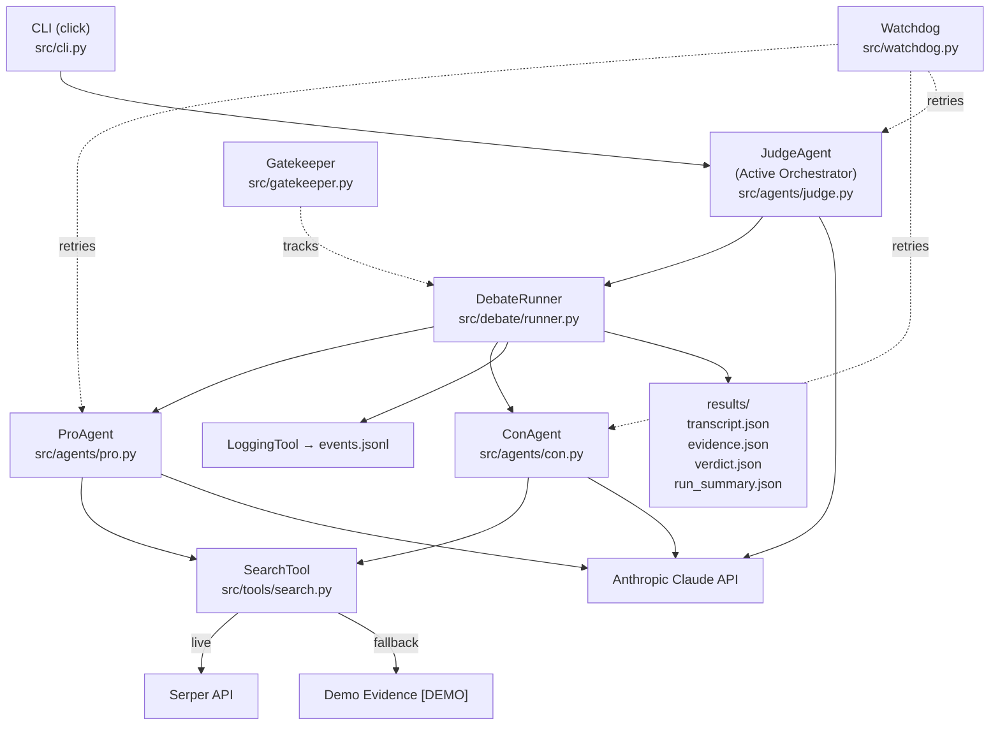
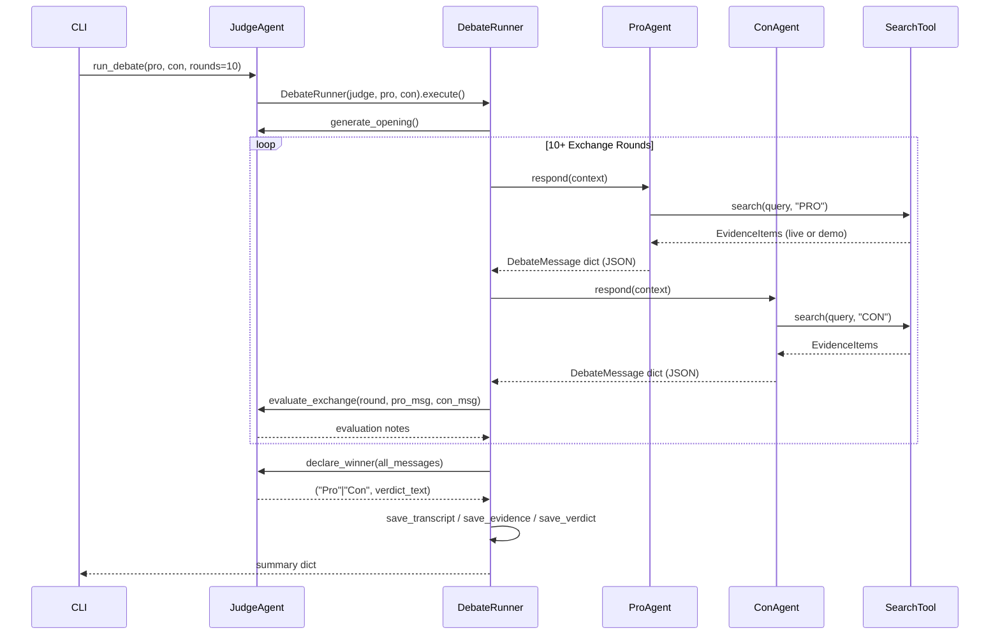
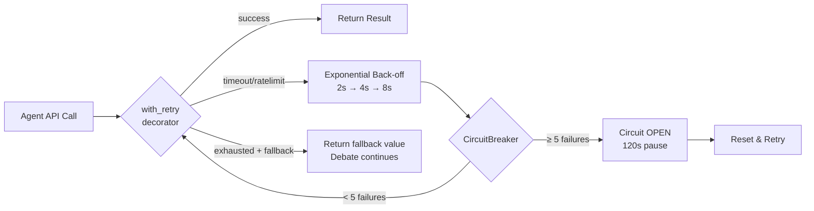

# AI Agent Debate System
### "Do Smartphones Make Us Less Smart?" — Senior Architecture v2

A CLI multi-agent AI debate: Pro vs Con with an active Judge moderator.
Structured JSON protocol · OOP inheritance · Skills/Tools separation · Watchdog · Gatekeeper.

---

## Architecture Diagram



---

## Sequence Diagram



---

## Skills vs Tools Separation

| Concept | Location | Purpose |
|---|---|---|
| **Skill** | `src/skills/*.md` | Defines HOW the agent thinks: system prompt, persona, fixed position, evaluation criteria |
| **Tool** | `src/tools/*.py` | Defines WHAT the agent can do: search evidence, log events, track costs |

- `src/skills/judge_skill.md` — Judge evaluation criteria, verdict format
- `src/skills/pro_skill.md` — Pro position and argument themes
- `src/skills/con_skill.md` — Con position and argument themes
- `src/tools/search.py` — SearchTool (Serper + fallback)
- `src/tools/logging_tool.py` — JSONL structured event logger

---

## JSON Communication Protocol

Every message between agents uses `DebateMessage` (`src/debate/protocol.py`):

```json
{
  "round_number": 3,
  "exchange_number": 3,
  "speaker": "Pro",
  "stance": "PRO",
  "claim": "Smartphones fragment attention...",
  "evidence": [
    {"snippet": "...", "url": "...", "source": "serper", "label": "live"}
  ],
  "tool_metadata": {
    "tools_used": ["search", "anthropic"],
    "search_queries": ["smartphones reduce attention span study"],
    "search_results_count": 3,
    "fallback_used": false
  },
  "rebuttal_target": "opponent's prior claim snippet...",
  "confidence_score": 0.85,
  "timestamp": "2026-06-07T21:11:50",
  "status": "complete"
}
```

---

## OOP Agent Hierarchy

```
BaseAgent (ABC)          # _load_skill(), _api_call(), respond()
  ├── DebaterAgent       # respond(), _call_claude() with retry, search integration
  │     ├── ProAgent     # stance=PRO, 10 rotating search queries
  │     └── ConAgent     # stance=CON, 10 rotating search queries
  └── JudgeAgent         # generate_opening(), evaluate_exchange(), declare_winner(), run_debate()
```

---

## Watchdog Design



- File: `src/watchdog.py`
- `with_retry(fallback=...)` — never kills the debate; returns fallback if all retries fail
- `CircuitBreaker` — global instance protects Serper API calls

---

## Gatekeeper Design

`src/gatekeeper.py` tracks per-run:

| Metric | Description |
|---|---|
| `rounds` | Debate rounds completed |
| `exchanges` | Pro+Con exchange pairs |
| `characters_used` | Total API response characters |
| `approx_tokens` | characters ÷ 4 estimate |
| `search_calls` | Total SearchTool invocations |
| `retries` | Watchdog retry events |
| `failures_recovered` | Calls recovered via fallback |

Saved to `results/run_summary.json`.

---

## External Search Setup

```bash
# Set in .env:
SERPER_API_KEY=your-key-from-serper.dev
```

If not set, the system automatically uses clearly-labelled demo evidence:
> `[DEMO EVIDENCE] Research suggests...`

Live search uses `https://google.serper.dev/search` (POST, `X-API-KEY` header).

---

## Fallback Mode

When `SERPER_API_KEY` is missing: search returns pre-written evidence labelled `"label": "fallback/demo"`.
When `ANTHROPIC_API_KEY` is missing: run `--demo` flag for pre-written full arguments.
The system never crashes due to missing keys — it degrades gracefully.

---

## UV Setup Commands

```bash
# Install UV
curl -LsSf https://astral.sh/uv/install.sh | sh

# Create virtual environment
uv venv .venv
source .venv/bin/activate   # Linux/Mac
# .venv\Scripts\activate    # Windows

# Install dependencies
uv pip install -r requirements.txt

# Configure API keys
cp .env.example .env
# Edit .env: ANTHROPIC_API_KEY=sk-ant-...  (required for live run)
#            SERPER_API_KEY=...             (optional — enables live search)
```

---

## CLI Run Commands

```bash
# Demo run — no API key required, architecture fully exercised
python -m src.main debate --demo

# Live run — requires ANTHROPIC_API_KEY in .env
python -m src.main debate

# Custom rounds (min 10)
python -m src.main debate --rounds 12

# Debug logging
python -m src.main debate --verbose

# Show loaded config
python -m src.main show-config

# Health-check Anthropic API
python -m src.main check-health

# Display saved transcript
python -m src.main show-transcript
```

---

## Verification Commands

```bash
# Run all 12 verification checks
python tests/verify.py

# Check every Python file is ≤ 150 lines
find src -name "*.py" | xargs wc -l | sort -n

# Inspect saved results
cat results/verdict.json
cat results/run_summary.json
head -5 results/events.jsonl | python3 -m json.tool
```

---

## Result Files

| File | Contents |
|---|---|
| `results/transcript.json` | All 20 DebateMessage objects with full JSON protocol |
| `results/evidence.json` | Evidence by round (Pro + Con) |
| `results/verdict.json` | Winner (`"Pro"` or `"Con"`) + full verdict text |
| `results/events.jsonl` | Structured JSONL event log |
| `results/run_summary.json` | Gatekeeper stats (rounds, tokens, searches, retries) |
| `results/debate.log` | Rotating loguru file log |

---

## GitHub Commit/Push Workflow

```bash
git add src/ tests/ results/ pyproject.toml .env.example plan.md README.md todo.md
git commit -m "feat: implement senior architecture v2 — OOP agents, JSON protocol, watchdog, gatekeeper"
git push origin main
git tag v2.0.0
git push origin --tags
```

---

## Assignment Metadata

- **Course:** Orchestration of AI Agents
- **Student:** awawdyamal04
- **Model:** claude-sonnet-4-6 (live) / pre-written args (demo)
- **Search:** Serper API with automatic fallback
- **Environment:** UV / Python 3.11+
- **Interface:** CLI only (`python -m src.main`)
