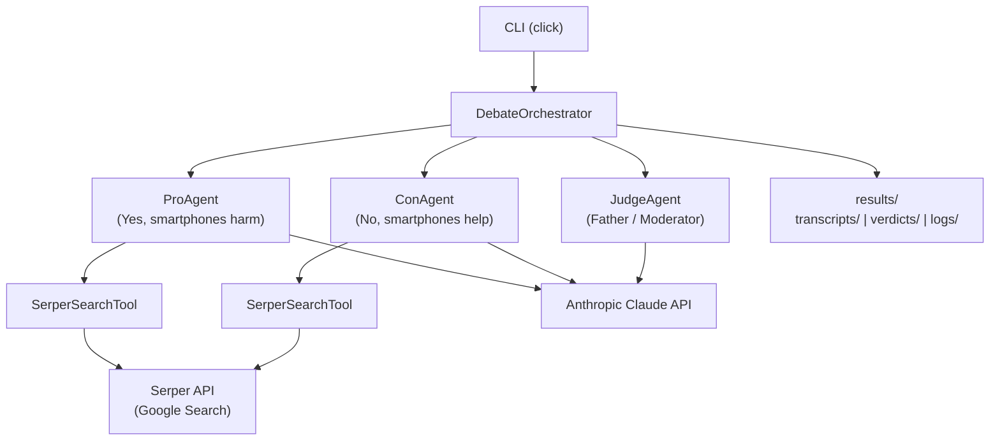
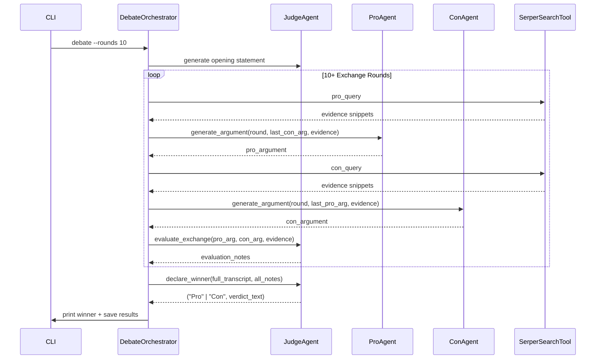
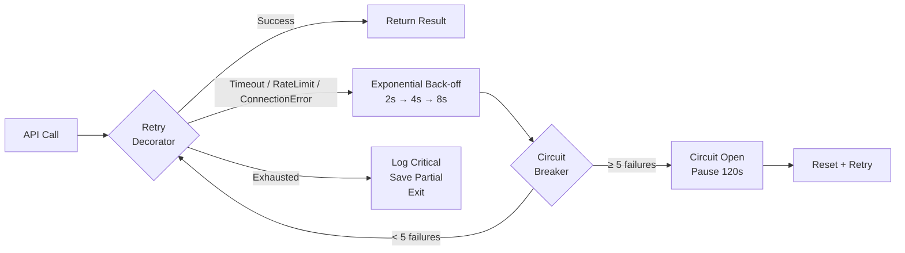

# AI Agent Debate System
### "Do Smartphones Make Us Less Smart?"

A CLI-based multi-agent AI system where two agents debate a controversial topic and a Judge agent moderates, evaluates, and declares one winner. Built for the **Orchestration of AI Agents** course assignment.

---

## Debate Topic

> **"Do smartphones make us less smart?"**

- **Pro Agent** argues: *Yes — smartphones reduce attention span, weaken memory, create dependency, distract from deep thinking, and erode independent problem-solving.*
- **Con Agent** argues: *No — smartphones increase knowledge access, support learning, improve productivity, enhance communication, and extend human intelligence when used correctly.*

---

## Agent Architecture

The system uses three Claude-powered agents coordinated by a central orchestrator:



---

## Debate Flow



---

## Watchdog / Retry Architecture



---

## Setup (using UV)

```bash
# 1. Clone the repository
git clone https://github.com/awawdyamal04/ai-agent-debate.git
cd ai-agent-debate

# 2. Create virtual environment with UV
uv venv .venv

# 3. Activate
source .venv/bin/activate        # Linux / Mac
# .venv\Scripts\activate          # Windows PowerShell

# 4. Install dependencies
uv pip install -r requirements.txt

# 5. Configure API keys
cp .env.example .env
# Edit .env and fill in your keys:
#   ANTHROPIC_API_KEY=sk-ant-...
#   SERPER_API_KEY=...
```

---

## Run Commands

```bash
# Run the full debate (default 10 rounds)
python -m src.cli debate

# Run with more rounds
python -m src.cli debate --rounds 15

# Verbose output (shows debug info)
python -m src.cli debate --verbose

# Check that API keys are working
python -m src.cli check-health

# Show loaded configuration
python -m src.cli show-config

# Display a saved transcript
python -m src.cli show-transcript results/transcripts/debate_20260607_120000.json
```

---

## Expected Output

When the debate runs, the console shows:

```
╔══════════════════════════════════════════════════════════╗
║       AI AGENT DEBATE — Round 1 / 10                    ║
╠══════════════════════════════════════════════════════════╣
║  PRO  │ Smartphones have been shown to reduce attention  ║
║       │ span. A Stanford study found that...            ║
╠══════════════════════════════════════════════════════════╣
║  CON  │ On the contrary, smartphones democratize access  ║
║       │ to education. UNESCO data shows...              ║
╚══════════════════════════════════════════════════════════╝

[Judge evaluating exchange 1...]

... (10+ rounds) ...

╔══════════════════════════════════════════════════════════╗
║  VERDICT                                                 ║
║  Winner: CON AGENT                                       ║
║  Reason: The Con agent provided stronger factual...      ║
╚══════════════════════════════════════════════════════════╝

Results saved to:
  Transcript: results/transcripts/debate_20260607_120000.json
  Verdict:    results/verdicts/verdict_20260607_120000.txt
  Log:        results/logs/debate_20260607_120000.log
```

---

## Where Results Are Saved

| File | Path | Contents |
|---|---|---|
| Transcript | `results/transcripts/debate_<timestamp>.json` | Full debate JSON with search evidence |
| Verdict | `results/verdicts/verdict_<timestamp>.txt` | Judge's decision and reasoning |
| Log | `results/logs/debate_<timestamp>.log` | Retry events, API calls, errors |

---

## Code Structure

```
src/
├── cli.py                    # click CLI entry point
├── config/
│   ├── settings.py           # env vars + constants
│   └── prompts.py            # all system prompts
├── agents/
│   ├── judge.py              # JudgeAgent
│   ├── pro.py                # ProAgent
│   └── con.py                # ConAgent
├── tools/
│   └── search.py             # SerperSearchTool
├── debate/
│   ├── orchestrator.py       # DebateOrchestrator
│   └── transcript.py         # dataclasses + serialization
├── watchdog/
│   └── retry.py              # with_retry, CircuitBreaker
└── utils/
    ├── logger.py             # loguru setup
    └── results.py            # file save/load helpers

tests/
├── conftest.py
├── test_search.py
├── test_watchdog.py
├── test_pro_agent.py
├── test_con_agent.py
├── test_judge.py
├── test_orchestrator.py
└── test_cli.py

results/
├── transcripts/
├── verdicts/
└── logs/
```

---

## Testing Instructions

```bash
# Run all unit tests
pytest tests/

# Verbose with short tracebacks
pytest tests/ -v --tb=short

# Run only integration tests (requires real API keys)
pytest tests/ -m integration

# Run with coverage
pytest tests/ --cov=src --cov-report=term-missing

# Check no file exceeds 150 lines (any result above 150 must be split before committing)
find src -name "*.py" -exec wc -l {} + | sort -n
```

---

## AI Prompts Used

### Pro Agent System Prompt (summary)
> "You are the Pro debater. Your fixed position is: YES, smartphones make us less smart. You must argue that smartphones reduce attention span, weaken memory, create cognitive dependency, distract from deep thinking, and erode independent problem-solving. You must maintain this position in every round without exception. Use the search evidence provided to support your claims with real data."

### Con Agent System Prompt (summary)
> "You are the Con debater. Your fixed position is: NO, smartphones do not make us less smart. You must argue that smartphones democratize knowledge, support lifelong learning, improve productivity, enhance communication, and extend human cognitive capabilities when used responsibly. Maintain this position in every round. Use the search evidence provided to support your claims."

### Judge Agent System Prompt (summary)
> "You are the Judge and moderator of this debate. You do not argue — you evaluate. After each exchange, assess argument quality, factual evidence, logical consistency, and relevance. After all rounds are complete, compile your notes and declare exactly one winner: either 'Pro' or 'Con'. A tie is not permitted. Provide your full reasoning."

---

## Vibe Coding Lifecycle

This project follows the **Vibe Coding** lifecycle:

| Stage | Description | Artifact |
|---|---|---|
| **Idea** | Define the concept and goals | Initial prompt |
| **PRD** | Formalize requirements | `prd.md` |
| **Plan** | Design modular architecture | `plan.md` |
| **TODO** | Break plan into granular tasks | `todo.md` |
| **Verify** | Review docs before coding | Human review checkpoint |
| **Execute** | Implement code module by module | `src/` |
| **Push** | Commit, tag, and submit | GitHub repository |

> No implementation code is written until the documentation is reviewed and approved.

---

## GitHub Submission Steps

```bash
# Initialize git (if not done)
git init
git remote add origin https://github.com/awawdyamal04/ai-agent-debate.git

# Stage and commit documentation
git add prd.md plan.md todo.md README.md requirements.txt .gitignore
git commit -m "docs: add Vibe Coding documentation files"

# After implementation, commit source
git add src/ tests/ results/ .env.example pyproject.toml
git commit -m "feat: implement multi-agent debate system"

# Tag and push
git tag v1.0.0
git push origin main --tags

# Submit the repository URL to the course portal
```

---

## Assignment Metadata

- **Course:** Orchestration of AI Agents
- **Student:** awawdyamal04
- **Model:** Claude (claude-sonnet-4-6 via Anthropic API)
- **Search:** Serper API (Google Search)
- **Environment:** UV virtual environment
- **Interface:** CLI only
